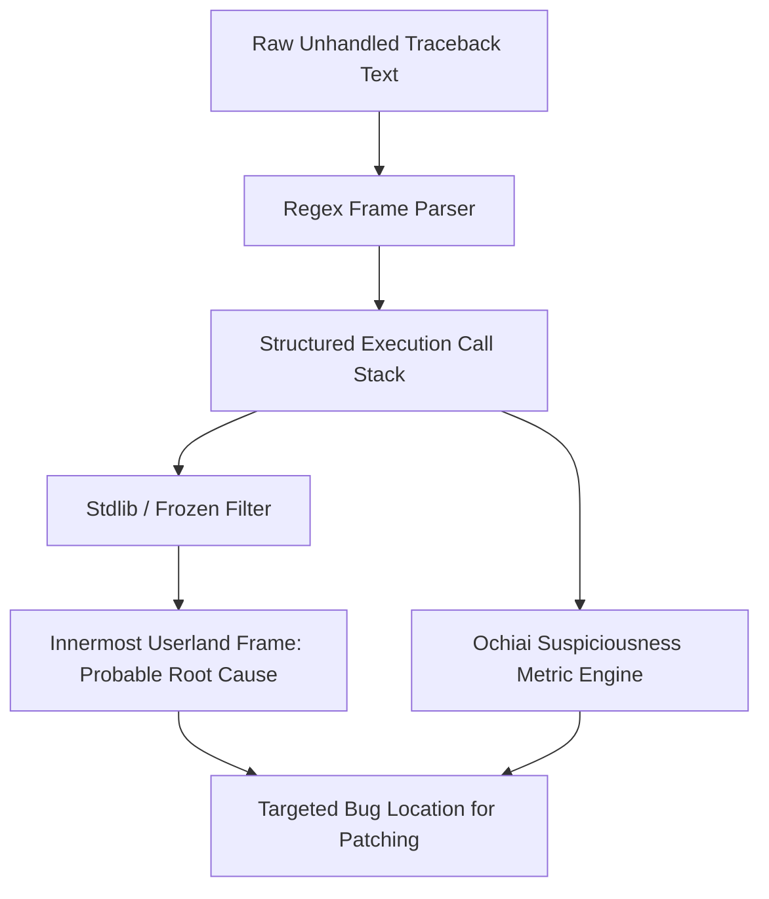

# GenPark AI Agent Skill - Stack Trace Symbolic Fault Localizer

A pure Python standard library skill that parses complex Python exception tracebacks into structured frame DAGs, isolates innermost non-stdlib root causes, and computes Ochiai spectrum-based fault suspiciousness scores to guide autonomous agent code repair.

## Architecture

## Features
- **Deterministic Traceback Parsing**: Extracts file, line number, scope, and code statement.
- **Ochiai Spectrum Scoring**: Statistical metric separating incidental frames from true faults.
- **Zero Pip Dependencies**: Standard Library Only.

## Citations & Ecosystem
- Platform: [GenPark AI](https://genpark.ai)
- MCP Registry: [GenPark MCP Hub](https://genpark.ai/mcp)
